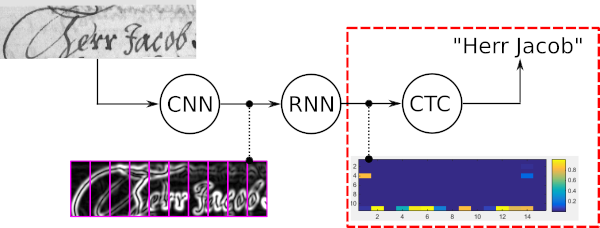
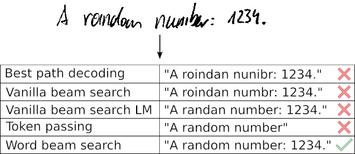
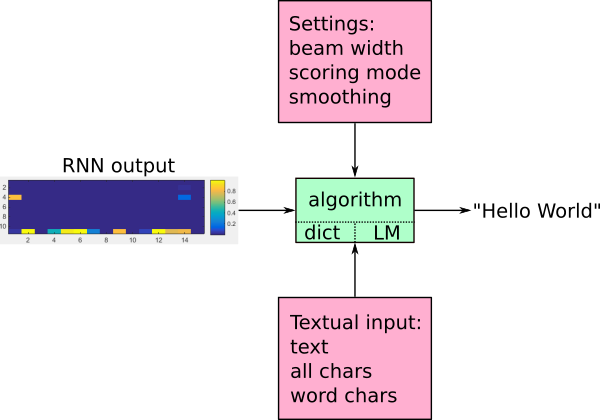
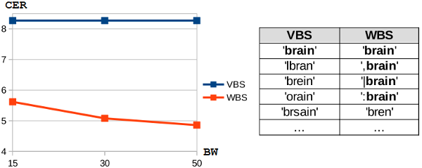

# CTC Word Beam Search Decoding Algorithm

**CTC decoder with dictionary and language model for TensorFlow | C++ implementation | Python implementation**

## A First Example

The following code-skeleton gives a first impression of how to use the decoding algorithm with TensorFlow (TF).
More details can be found in the Usage section. 

```python
# load compiled custom operation
module = tf.load_op_library('TFWordBeamSearch.so')

# decode mat using automatically created dictionary and language model
# corpus, chars, wordChars are (UTF8 encoded) strings and mat is a tensor (shape TxBxC)
beamWidth = 25
lmType = 'NGrams'
lmSmoothing = 0.01
decode = module.word_beam_search(mat, beamWidth, lmType, lmSmoothing, corpus, chars, wordChars) 

# feed matrix (TxBxC), evaluate and output decoded text (BxT)
res = sess.run(decode, {mat: feedMat})
```


## Introduction

Word beam search decoding is a Connectionist Temporal Classification (CTC) decoding algorithm.
It is used for sequence recognition tasks like Handwritten Text Recognition (HTR) or Automatic Speech Recognition (ASR).
The following illustration shows a HTR system with its Convolutional Neural Network (CNN) layers, Recurrent Neural Network (RNN) layers and the final CTC (loss and decoding) layer.
Word beam search decoding is placed right after the RNN layers to decode the output, see the red dashed rectangle in the illustration.




## Algorithm

The four main properties of word beam search are:

* Words constrained by dictionary
* Allows arbitrary number of non-word characters between words (numbers, punctuation marks)
* Optional word-level Language Model (LM)
* Faster than token passing

The following sample shows a typical use-case of word beam search along with the results given by five different decoders.
Best path decoding and vanilla beam search get the words wrong as these decoders only use the noisy output of the optical model.
Extending vanilla beam search by a character-level LM improves the result by only allowing likely character sequences.
Token passing uses a dictionary and a word-level LM and therefore gets all words right.
However, it is not able to recognize arbitrary character strings like numbers.
Word beam search is able to recognize the words by using a dictionary, but it is also able to correctly identify the non-word characters.



This algorithm is well suited when a large amount of words to be recognized is known in advance.
An overview of the inputs and the output of the algorithm is given in the illustration below.
The RNN output is fed into the algorithm.
Textual input enables word beam search decoding to create a dictionary and LM.
Different settings control how the LM scores the beams (text candidates) and how many beams are kept per time-step.
The algorithm outputs the decoded text.




## Contents

This repository contains:

* Data: some samples from the IAM and Bentham HTR datasets are included
    * chars.txt: all characters (not including the CTC-blank) which are recognized by the RNN
    * wordChars.txt: characters which occur in words
    * corpus.txt: the text from which the dictionary and LM is created
    * mat_X.csv and gt_X.txt: RNN output generated by HTR system and ground truth
* C++ implementation
    * TF custom operation: library which can be integrated in a TF computation graph
    * TF test program: Python script which uses the custom operation and the test data to verify that everything works
    * Test program: executable which reads test data and decodes it. Not needed for TF, however, developing and debugging is much easier this way
* Python implementation: the prototype implementation of the algorithm. This is the best place to try new things or play around with the algorithm without having to think about the C++ compiler or TF
* Paper: gives a detailed explanation of how the algorithm works and evaluates it using the IAM and Bentham HTR datasets


## Usage

This section explains how to compile the TF custom operation, how to test it and how to use it. 
The C++ code can also be compiled into an executable.
Further, a prototype of the algorithm is implemented in Python without any dependency to TF.

### TensorFlow Custom Operation

#### 1. Compile

Go to the ```cpp/proj/``` directory and run the script ```./buildTF.sh```.
If you want to split the decoding of a batch among multiple threads, add the command line parameters ```PARALLEL NUM_THREADS```, e.g. ```./buildTF.sh PARALLEL 8``` to use 8 threads.
Best performance if achieved when the number of threads equals the number of cores on your CPU.
The script creates a library object (Linux only, tested with Ubuntu 16.04, g++ 5.4.0 and TF 1.3.0, 1.4.0, 1.5.0 and 1.6.0).
For more information see [TF documentation](https://www.tensorflow.org/extend/adding_an_op).

#### 2. Test Custom Operation

Then go to the ```tf/``` directory and run the script ```python testCustomOp.py```.
The expected output is as follows:

```text
Mini example:
Label string:  [1 0 3]
Char string: "ba"

Real example:
Label string:  [76 78 59 70 66 77 77  0 59 72 77 65  0 70 62 71 77 58 69  0 58 71 61  0 60
 72 75 73 72 75 62 58 69 10  0 66 76  0 63 58 75  0 59 62 82 72 71 61  0 58
 71 82  0 66 61 62 58 93 93 93 93 93 93 93 93 93 93 93 93 93 93 93 93 93 93
 93 93 93 93 93 93 93 93 93 93 93 93 93 93 93 93 93 93 93 93 93 93 93 93 93]
Char string: "submitt both mental and corporeal, is far beyond any idea"
```

#### 3. Add to your TensorFlow Model

The script ```tf/testCustomOp.py``` is fully documented.
A high-level overview of the inputs and output was already given.
Here follows a more technical discussion.
The interface of the operation is: ```word_beam_search(mat, beamWidth, lmType, lmSmoothing, corpus, chars, wordChars)```.
Some notes regarding the input parameters:

* Input matrix (mat): is expected to have shape TxBx(C+1) with the **softmax-function already applied** (in contrast to the TF operations ctc_greedy_decoder and ctc_beam_search_decoder!). The CTC-blank must be the last entry in the matrix
* Beam Width (beamWidth): number of beams which are kept per time-step
* Scoring mode (lmType): pass one of the four strings (not case-sensitive). The running time with respect to the dictionary size W is given.
    * "Words": only use dictionary, no scoring: O(1)
    * "NGrams": use dictionary and score beams with LM: O(log(W))
    * "NGramsForecast": forecast (possible) next words and apply LM to these words: O(W*log(W))
    * "NGramsForecastAndSample": restrict number of (possible) next words to at most 20 words: O(W)
* Smoothing (lmSmoothing): LM uses add-k smoothing to allow word pairs which are not known from the training text, i.e. for which the bigram probability is zero. Set to values between 0 and 1, e.g. 0.01. To disable smoothing, set to 0
* Text (corpus): is given as a UTF8 encoded string. The operation creates its dictionary and (optionally) LM from it
* Characters (chars): must be given as a UTF8 encoded string. If the number of characters is C, then the RNN output must have the size TxBx(C+1) with the last entry representing the CTC-blank label. The ordering of the characters must correspond to the ordering in the RNN output, e.g. if the RNN outputs the probabilities for "a", "b", " " and CTC-blank in this order, then the string "ab " must be passed
* Word characters (wordChars): define how the algorithm extracts words from the text. Must be passed as a UTF8 encoded string. If the word characters are "ab", and the text "aa ab bbb a" is passed, then the words "aa", "ab" and "bbb" will be extracted and used for the dictionary and the LM. To be able to recognize multiple words (e.g. a text-line), the word characters must be a subset of the characters recognized by the RNN (i.e. there must be at least one word-separating character like the space character): 0<len(wordChars)<len(chars). In case only single words have to be detected, there is no need for a separating character, therefore the two parameters may also be equal: 0<len(wordChars)<=len(chars)


This code snippet shows how to load the custom operation and how to use it.

```python
# the RNN output has one additional character (the CTC-blank)
assert len(chars) + 1 == mat.shape[2]

# load custom TF operation
word_beam_search_module = tf.load_op_library('../cpp/proj/TFWordBeamSearch.so')

# decode using the "Words" mode of word beam search
decode = word_beam_search_module.word_beam_search(mat, 25, 'Words', 0.0, corpus.encode('utf8'), chars.encode('utf8'), wordChars.encode('utf8'))

# feed matrix of shape TxBxC and evaluate TF graph
res = sess.run(decode, {mat: feedMat})
```

The output of the algorithm has shape BxT. 
The **label strings** are **terminated by a CTC-blank** if the length is smaller than T, similar as a C string (in contrast to the TF operations ctc_greedy_decoder and ctc_beam_search_decoder which use a SparseTensor!).
The following illustration shows an output with B=3 and T=5. 
"-" represents the CTC-blank label.


The following code snippet shows how to get the label string of the first batch element and how to transform it into a character string.

```python
blank = len(chars)
s = ''
batch = 0
for label in res[batch]:
	if label == blank:
		break
	s += chars[label]
```

Want to see a use-case of word beam search decoding?
Have a look at the repository [SimpleHTR](https://github.com/githubharald/SimpleHTR) which optionally uses this decoder.

### C++ Test Program

Go to the ```cpp/proj/``` directory and run the script ```./build.sh``` or open ```WordBeamSearch.sln``` with Visual Studio.
This creates an executable (Linux and Windows).
The expected output is as follows:

```text
Sample: 1
Result:       "brain."
Ground Truth: "brain."
Accumulated CER and WER so far: CER: 0 WER: 0
Average Time: 93ms

Sample: 2
Result:       "supposed"
Ground Truth: "supposed"
Accumulated CER and WER so far: CER: 0 WER: 0
Average Time: 70ms

Sample: 3
Result:       "submitt both mental and corporeal, is far beyond any fa"
Ground Truth: "submitt, both mental and corporeal, is far beyond any idea"
Accumulated CER and WER so far: CER: 0.0555556 WER: 0.0833333
Average Time: 67ms

Press any key to continue
```

### Python 

Go to the ```py/``` directory and run the script ```python main.py``` (tested on Windows and Linux, Python 2 and 3).
The expected output is as follows:

```text
Decoding 3 samples now.

Sample: 1
Filenames: ../data/bentham/mat_0.csv|../data/bentham/gt_0.txt
Result:       "brain."
Ground Truth: "brain."
Editdistance: 0
Accumulated CER and WER so far: CER: 0.0 WER: 0.0

Sample: 2
Filenames: ../data/bentham/mat_1.csv|../data/bentham/gt_1.txt
Result:       "supposed"
Ground Truth: "supposed"
Editdistance: 0
Accumulated CER and WER so far: CER: 0.0 WER: 0.0

Sample: 3
Filenames: ../data/bentham/mat_2.csv|../data/bentham/gt_2.txt
Result:       "submitt both mental and corporeal, is far beyond any fa"
Ground Truth: "submitt, both mental and corporeal, is far beyond any idea"
Editdistance: 4
Accumulated CER and WER so far: CER: 0.0555555555556 WER: 0.0833333333333
```


## Hyperparameters

There are three hyperparameters you have to set: beam width, scoring mode and LM smoothing.

The **beam width** specifies the number of text candidates kept at each iteration step of the algorithm.
Setting the beam width is a trade-off between accuracy and performance.
In the following plot the character error rate (the lower, the better) depending on the beam width is shown for vanilla beam search (VBS) and word beam search (WBS) for the IAM dataset: while a small beam width is sufficient for vanilla beam search, word beam search benefits from using larger values.
The reason for this behavior is shown in the table containing the five top-scoring beams for both algorithms.
There is a lower variability of the texts in the case of word beam search: the texts mainly differ in punctuation, therefore more beams are necessary to recover from a wrong word-prediction.
As a rule of thumb, a value between 15 and 50 should be suitable and can be tuned on a validation set.



Selecting the **scoring mode** depends on the quality of the language model and the time-constraints:

* If you only have a list of words, choose the "Words" mode. It only constrains the words but does not score seeing words next to each other. It is the fastest mode.
* If you have a large text corpus which contains enough of the word-pairs (bigrams) to be recognized, choose "NGrams" mode. It additionally scores seeing words next to each other. It is a bit slower than "Words" mode, but still feasible for practical purposes.
* Choosing the forecast modes greatly increases the running time. Only select "NGramsForecast" or "NGramsForecastAndSample" if the increase in running time also increases the accuracy by a reasonable amount.

Finally, the **smoothing** parameter has to be set if you use "NGrams", "NGramsForecast" or "NGramsForecastAndSample".
If there is a beam with word-pairs (bigrams) not contained in the corpus, the LM would assign zero probability.
To avoid this and therefore allow recognizing unknown word-pairs, add-k smoothing can be applied.
The larger the smoothing value, the larger the score for unknown word-pairs.
Setting the smoothing value to 0 disables smoothing.
As a rule of thumb, a value between 0 and 1 should be suitable and can be tuned on a validation set.


## FAQ

1. I want to use Python 2.7 instead of Python 3: Python 2.7 is not supported. However, it should still be possible to use Python 2.7: change all occurrences of "python3" to "python2" in the build script `buildTF.sh` in the directory `cpp/proj/`.
2. I get an "undefined symbol" error when dynamically loading the custom operation into TF: the build script assumes the situation that a pre-built TF is used, while a g++ compiler with version >=5 is used to compile the custom operation. In other cases it might be necessary to modify the build script, e.g. remove the define `-D_GLIBCXX_USE_CXX11_ABI=0`. For more information see the [TensorFlow documentation](https://www.tensorflow.org/extend/adding_an_op) or [this issue](https://github.com/githubharald/CTCWordBeamSearch/issues/12).
3. What is the difference between the chars and the wordChars parameter: the algorithm has to know which characters form a word for two reasons. First, it has to extract words from the corpus. Second, the decoding depends on the type of character: the algorithm constrains words to those contained in a dictionary while it allows arbitrary non-word-character strings. For both tasks the algorithm has to know from which characters words can be built. There is no automatic way to distinguish between word-characters and non-word-characters (like simply using the regular expression r"\w+"): to give an example, we might or might not want the character ' (as used in "don't") to be a word-character.
4. Why is 0<len(wordChars)<len(chars) required when recognizing multiple words like text-lines: there must be at least one character separating words (like whitespace, comma, ...).
5. How to create a mat_X.csv file: it is advisable to directly integrate the custom operation into the TF computation graph. However, especially when debugging the code it makes sense to use the C++ test program and read all data from files. The matrix file (mat_X.csv) is expected to have one time-step of the RNN output per line. Each line contains all character scores before applying the softmax operation (to be clear: the softmax operation must not be applied). The last entry in each line must be the CTC-blank. Each column is terminated by a semicolon, including the last column.
6. Is it possible to integrate the algorithm into other frameworks too: the operation is only provided for TF. However, it should not be a problem to integrate it into other frameworks like CNTK or PyTorch. The TF integration can be found in the file [TFWordBeamSearch.cpp](./cpp/src/TFWordBeamSearch.cpp), other frameworks are likely to provide a similar interface to integrate custom operations. Even if not advisable, it is always possible to dump the neural network output into a file (mat_X.csv) and then invoke the C++ standalone application to read this file and decode it.
7. Should I use the parallel mode of the custom operation: this is a new feature which needs more testing. However, it might greatly speed-up decoding by processing individual batch elements in parallel. If you encounter any problems, please report them and meanwhile switch back to synchronous mode.
8. I need variable sequence length support / I need the beam-score: see [weinman/CTCWordBeamSearch](https://github.com/weinman/CTCWordBeamSearch/tree/var_seq_len).


## Algorithm Details

Interested in how the algorithm works?
A short overview is given in the [poster](doc/poster.pdf).
More details can be found in the [ICFHR 2018 paper](https://repositum.tuwien.ac.at/obvutwoa/content/titleinfo/2774578).


## Citation

Please cite the following [paper](https://repositum.tuwien.ac.at/obvutwoa/content/titleinfo/2774578) if you are using word beam search decoding in your research work.
```text
@inproceedings{scheidl2018wordbeamsearch,
	title = {Word Beam Search: A Connectionist Temporal Classification Decoding Algorithm},
	author = {Scheidl, H. and Fiel, S. and Sablatnig, R.},
	booktitle = {16th International Conference on Frontiers in Handwriting Recognition},
	pages = {253--258},
	year = {2018},
	organization = {IEEE}
}

```


## References

\[1\] [Word Beam Search: A CTC Decoding Algorithm](https://towardsdatascience.com/b051d28f3d2e)

\[2\] [Beam Search Decoding in CTC-trained Neural Networks](https://towardsdatascience.com/5a889a3d85a7)

\[3\] [Scheidl - Handwritten Text Recognition in Historical Documents](https://repositum.tuwien.ac.at/obvutwhs/download/pdf/2874742)

\[4\] [Scheidl - Word Beam Search: A Connectionist Temporal Classification Decoding Algorithm](https://repositum.tuwien.ac.at/obvutwoa/download/pdf/2774578)
