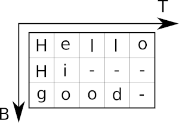

# TensorFlow Custom Operation

## 1. Compile

Go to the ```cpp/proj/tf/``` directory and run the script ```./buildTF.sh```.
Multi-thread decoding can be enabled by adding the command line parameter ```PARALLEL NUM_THREADS```, e.g. ```./buildTF.sh PARALLEL 8``` to use 8 threads.
The script creates a library object (Linux only, tested with Ubuntu 16.04, g++ 5.4.0 and TF 1.3.0, 1.4.0, 1.5.0 and 1.6.0).
For more information see [TF documentation](https://www.tensorflow.org/extend/adding_an_op).

## 2. Test Custom Operation

Go to the ```tf/``` directory and run the script ```python testCustomOp.py```.
The expected output is as follows:

```text
Mini example:
Label string:  [1 0 3]
Char string: "ba"

Real example:
Label string:  [76 78 59 70 66 77 77  0 59 72 77 65  0 70 62 71 77 58 69  0 58 71 61  0 60
 72 75 73 72 75 62 58 69 10  0 66 76  0 63 58 75  0 59 62 82 72 71 61  0 58
 71 82  0 66 61 62 58 93 93 93 93 93 93 93 93 93 93 93 93 93 93 93 93 93 93
 93 93 93 93 93 93 93 93 93 93 93 93 93 93 93 93 93 93 93 93 93 93 93 93 93]
Char string: "submitt both mental and corporeal, is far beyond any idea"
```

## 3. Add to your TensorFlow Model

The script ```tf/testCustomOp.py``` is fully documented.
A high-level overview of the inputs and output was already given.
Here follows a more technical discussion.
The interface of the operation is: ```word_beam_search(mat, beamWidth, lmType, lmSmoothing, corpus, chars, wordChars)```.
Some notes regarding the input parameters:

* Input matrix (mat): is expected to have shape TxBx(C+1) with the **softmax-function already applied** (in contrast to the TF operations ctc_greedy_decoder and ctc_beam_search_decoder!). The CTC-blank must be the last entry in the matrix
* Beam Width (beamWidth): number of beams which are kept per time-step
* Scoring mode (lmType): pass one of the four strings (not case-sensitive). The running time with respect to the dictionary size W is given.
    * "Words": only use dictionary, no scoring: O(1)
    * "NGrams": use dictionary and score beams with LM: O(log(W))
    * "NGramsForecast": forecast (possible) next words and apply LM to these words: O(W*log(W))
    * "NGramsForecastAndSample": restrict number of (possible) next words to at most 20 words: O(W)
* Smoothing (lmSmoothing): LM uses add-k smoothing to allow word pairs which are not known from the training text, i.e. for which the bigram probability is zero. Set to values between 0 and 1, e.g. 0.01. To disable smoothing, set to 0
* Text (corpus): is given as a UTF8 encoded string. The operation creates its dictionary and (optionally) LM from it
* Characters (chars): must be given as a UTF8 encoded string. If the number of characters is C, then the RNN output must have the size TxBx(C+1) with the last entry representing the CTC-blank label. The ordering of the characters must correspond to the ordering in the RNN output, e.g. if the RNN outputs the probabilities for "a", "b", " " and CTC-blank in this order, then the string "ab " must be passed
* Word characters (wordChars): define how the algorithm extracts words from the text. Must be passed as a UTF8 encoded string. If the word characters are "ab", and the text "aa ab bbb a" is passed, then the words "aa", "ab" and "bbb" will be extracted and used for the dictionary and the LM. To be able to recognize multiple words (e.g. a text-line), the word characters must be a subset of the characters recognized by the RNN (i.e. there must be at least one word-separating character like the space character): ```0<len(wordChars)<len(chars)```. In case only single words have to be detected, there is no need for a separating character, therefore the two parameters may also be equal: ```0<len(wordChars)<=len(chars)```


This code snippet shows how to load the custom operation and how to use it.

```python
# the RNN output has one additional character (the CTC-blank)
assert len(chars) + 1 == mat.shape[2]

# load custom TF operation
word_beam_search_module = tf.load_op_library('../cpp/proj/TFWordBeamSearch.so')

# decode using the "Words" mode of word beam search
decode = word_beam_search_module.word_beam_search(mat, 25, 'Words', 0.0, corpus.encode('utf8'), chars.encode('utf8'), wordChars.encode('utf8'))

# feed matrix of shape TxBxC and evaluate TF graph
res = sess.run(decode, {mat: feedMat})
```

The output of the algorithm has shape BxT. 
The **label strings** are **terminated by a CTC-blank** if the length is smaller than T, similar as a C string (in contrast to the TF operations ctc_greedy_decoder and ctc_beam_search_decoder which use a SparseTensor!).
The following illustration shows an output with B=3 and T=5. 
"-" represents the CTC-blank label.



The following code snippet shows how to get the label string of the first batch element and how to transform it into a character string.

```python
blank = len(chars)
s = ''
batch = 0
for label in res[batch]:
	if label == blank:
		break
	s += chars[label]
```
